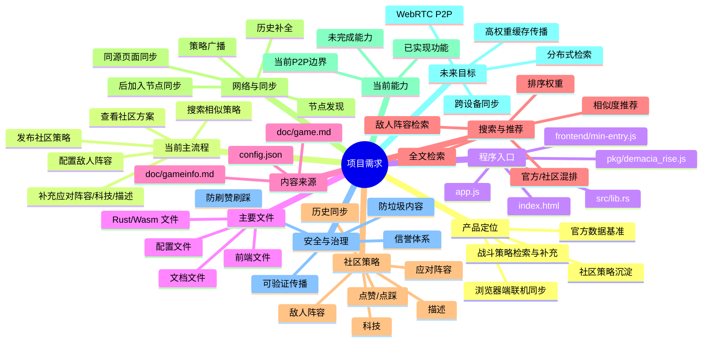

# 项目需求与上下文入口
## 英雄联盟：德玛西亚的崛起 - 策略模拟器

---

## 1. 文档用途
本文件用于后续与大模型协作时提供统一上下文，目标包括：
- 说明项目当前定位与主流程
- 指明真实代码入口与核心文件
- 标注不同文档和数据文件的可信度
- 提供可直接展开为脑图的需求结构

原则：
- 先看当前实现，再讨论未来目标
- 先看结构化数据，再看描述性文档
- 文档与代码冲突时，以当前代码和 `config.json` 为准

---

## 2. 项目定位
这是一个以**敌人阵容检索**与**社区策略补充**为核心的浏览器端策略模拟器。

当前产品目标：
- 用户先配置敌人阵容
- 系统优先检索已有社区策略
- 如无合适结果，用户继续补充应对阵容、科技与描述
- 最终发布为新的社区策略

当前交互原则：
- 搜索优先，填写其次
- 复用已有策略优先于重复创建
- 描述是策略主要表达内容，标题弱化

---

## 3. 当前主流程
### 3.1 战斗策略主流程
1. 选择或输入敌人阵容
2. 自动或手动触发相似策略搜索
3. 查看社区已有应对方案
4. 补充应对阵容、科技、策略描述
5. 发布到社区策略库
6. 其他节点同步并可继续检索

### 3.2 当前重点字段
- 敌人阵容
- 应对阵容
- 科技
- 策略描述

说明：
- 标题不是核心字段，可自动生成或弱化处理

---

## 4. 程序入口与核心文件
### 4.1 程序入口
当前真实入口链路如下：

```text
index.html
  -> app.js
    -> frontend/min-entry.js
      -> pkg/demacia_rise.js
        -> src/lib.rs
```

### 4.2 前端核心文件
- `index.html`：页面结构与主要 DOM 容器
- `app.js`：前端入口转发层
- `app.css`：样式文件
- `frontend/min-entry.js`：前端主逻辑入口
- `frontend/config-ui.js`：配置型 UI 渲染
- `frontend/data.js`：从配置中提取单位、英雄、敌人数据
- `frontend/state.js`：前端状态集中管理
- `frontend/utils.js`：工具函数

### 4.3 Rust / Wasm 核心文件
- `src/lib.rs`：Wasm 对外导出入口
- `src/search.rs`：搜索与推荐逻辑
- `src/storage.rs`：社区策略存储、远端导入、历史补全
- `src/p2p.rs`：前端桥接层
- `src/engine.rs`：策略分数与基础计算逻辑
- `src/data_model.rs`：核心数据结构
- `src/github_sync.rs`：官方数据拉取

### 4.4 关键导出接口
`src/lib.rs` 当前关键接口：
- `load_official_data`
- `create_strategy`
- `get_strategies`
- `search`
- `recommend_strategies_for_enemy`
- `vote`
- `create_p2p_node`
- `p2p_receive_json`
- `p2p_receive_history_json`

---

## 5. 游戏内容与文本来源
### 5.1 结构化真相来源
优先使用 `config.json`，当前它是最重要的结构化内容来源，包含：
- 英雄
- 单位
- 敌人
- 敌人组合
- 科技树
- 建筑
- 地图节点

### 5.2 叙述型文本来源
- `doc/gameinfo.md`：当前版本较贴近实现的游戏内容参考
- `doc/game.md`：更完整的背景与扩展设计资料，但未必全部已实现

### 5.3 默认使用规则
- 生成当前版本相关内容时：优先 `config.json`，其次 `doc/gameinfo.md`
- 生成扩展玩法或长期设定时：可参考 `doc/game.md`
- 如有冲突：以 `config.json` 和当前代码为准

---

## 6. 文档可信度分层
### 6.1 第一层：实现真相
- `frontend/min-entry.js`
- `src/lib.rs`
- `src/search.rs`
- `src/storage.rs`
- `config.json`
- `index.html`

### 6.2 第二层：需求与交互意图
- `need.md`
- `doc/gameinfo.md`

### 6.3 第三层：背景与愿景参考
- `doc/game.md`
- `readme.md`
- 其他总结类文档

说明：
- `readme.md` 含较多愿景与旧结构描述，不能直接视为当前实现结构图
- 当前项目真实运行方式更接近：`HTML + JS + Rust/WASM + 同源浏览器同步`

---

## 7. 当前能力边界
### 7.1 当前已实现
- 官方数据读取
- 社区策略创建与展示
- 基于敌人阵容的相似策略推荐
- 本地全文检索
- 同源页面之间的本地消息同步
- 新节点加入后的历史社区策略补全
- 社区策略列表与基础投票

### 7.2 当前网络边界
当前“P2P”更接近：
- 同源浏览器实例之间的本地联机同步

当前主要依赖：
- `BroadcastChannel`
- `storage` 事件兜底

当前尚不是完整的公网 WebRTC 去中心化网络。

### 7.3 当前未完成事项
- 不同设备自动发现
- 局域网真实自动组网
- 公网 WebRTC 完整信令流程
- 全网查询广播与按需返回
- 高权重策略自动扩散缓存
- 完整信誉与反刷机制

---

## 8. 未来目标
### 8.1 网络目标
- 浏览器原生 WebRTC P2P
- 跨标签页、跨浏览器、跨设备同步
- 局域网自动发现
- 后续支持广域网对等连接

### 8.2 数据目标
- 官方数据作为可信基准
- 社区策略分布式同步
- 查询优先、按需返回
- 高权重策略多节点缓存
- 低价值数据不占用本地空间

### 8.3 搜索目标
- 面向敌人阵容的精准推荐
- 面向描述、科技、单位的全文检索
- 社区策略与官方方案混合排序
- 支持查询全网而不仅限本地节点

### 8.4 共识目标
- 点赞 / 点踩影响排序
- 高质量策略提升曝光
- 后续叠加信誉值与信任传播

---

## 9. 搜索与推荐要求
### 9.1 核心搜索对象
- 敌人阵容
- 应对阵容
- 科技选择
- 战术描述
- 官方推荐关键词

### 9.2 目标体验
- 输入敌人阵容后，立即返回社区相似策略
- 推荐结果应包含：
  - 建议阵容
  - 对应描述
  - 相似度或排序依据
- 无结果时，明确提示用户继续补充自己的方案

### 9.3 排序目标
- 官方数据优先级最高
- 高相似度优先
- 高赞策略优先
- 后续可叠加：信誉值、新鲜度、重要标记

参考权重公式：

```text
得分 = 官方标识*1000 + 点赞*2 - 点踩*3 + 信任值*5 + 新鲜度*10 + 重要标记*50
```

---

## 10. 社区策略要求
### 10.1 核心字段
- 敌人阵容
- 应对阵容
- 科技
- 描述
- 点赞数
- 点踩数
- 分数 / 权重

### 10.2 产品目标
- 快速补充策略
- 复用已有方案
- 同一敌人阵容下形成策略池
- 高质量方案持续上浮
- 新节点可补齐历史方案

### 10.3 当前展示重点
- 描述
- 敌人阵容
- 应对阵容
- 科技
- 评分

---

## 11. 技术架构摘要
### 11.1 当前技术栈
- 前端：原生 HTML / CSS / JS
- 核心逻辑：Rust + WASM
- 本地同步：浏览器消息通道
- 本地存储：可逐步结合 IndexedDB

### 11.2 当前架构关键词
- 无传统后端服务依赖
- 浏览器本地运行
- 社区策略同步
- 轻量化、可扩展、低成本

### 11.3 未来架构关键词
- 无服务器
- 去中心化
- WebRTC
- 分布式检索
- 分布式缓存
- 节点自动发现
- 节点自动组网

---

## 12. 安全与治理
### 12.1 当前关注点
- 防止垃圾内容泛滥
- 防止重复策略刷屏
- 防止恶意刷赞 / 刷踩
- 为后续身份与信誉系统预留接口

### 12.2 未来方向
- 唯一身份
- 内容哈希
- 信任加权
- 冷却机制
- 反机器人
- 反女巫攻击
- 可验证传播

---

## 13. 非功能要求
- 高性能：WASM 计算，前端不卡顿
- 轻量化：浏览器、移动端可运行
- 可扩展：可逐步接入 WebRTC、信誉系统、PWA
- 可维护：结构应适合持续迭代
- 可理解：需求表达应适合生成脑图、流程图、模块图

---

## 14. 需求脑图（文档内嵌版）
### 14.1 文字树版
```text
项目需求
├─ 产品定位
│  ├─ 战斗策略检索与补充
│  ├─ 官方数据基准
│  ├─ 社区策略沉淀
│  └─ 浏览器端联机同步
├─ 当前主流程
│  ├─ 配置敌人阵容
│  ├─ 搜索相似策略
│  ├─ 查看社区方案
│  ├─ 补充应对阵容 / 科技 / 描述
│  └─ 发布社区策略
├─ 程序入口
│  ├─ index.html
│  ├─ app.js
│  ├─ frontend/min-entry.js
│  ├─ pkg/demacia_rise.js
│  └─ src/lib.rs
├─ 主要文件
│  ├─ 前端文件
│  ├─ Rust/Wasm 文件
│  ├─ 配置文件
│  └─ 文档文件
├─ 内容来源
│  ├─ config.json（结构化真相）
│  ├─ doc/gameinfo.md（当前内容参考）
│  └─ doc/game.md（扩展设计参考）
├─ 搜索与推荐
│  ├─ 敌人阵容检索
│  ├─ 相似度推荐
│  ├─ 全文检索
│  ├─ 官方/社区混排
│  └─ 排序权重
├─ 社区策略
│  ├─ 敌人阵容
│  ├─ 应对阵容
│  ├─ 科技
│  ├─ 描述
│  ├─ 点赞/点踩
│  └─ 历史同步
├─ 网络与同步
│  ├─ 同源页面同步
│  ├─ 节点发现
│  ├─ 策略广播
│  ├─ 历史补全
│  └─ 后加入节点同步
├─ 当前能力
│  ├─ 已实现功能
│  ├─ 当前 P2P 边界
│  └─ 未完成能力
├─ 未来目标
│  ├─ WebRTC P2P
│  ├─ 跨设备同步
│  ├─ 分布式检索
│  └─ 高权重缓存传播
└─ 安全与治理
   ├─ 防垃圾内容
   ├─ 防刷赞刷踩
   ├─ 信誉体系
   └─ 可验证传播
```

### 14.2 Mermaid 脑图版


---

## 15. 后续协作默认规则
### 15.1 若继续开发，优先级默认如下
- 先保证战斗策略编辑 + 搜索推荐主流程完整
- 先保证社区策略同步与搜索可用
- 先保证后加入节点能补齐历史数据
- 先优化描述驱动的策略表达
- 再推进真实 WebRTC P2P

### 15.2 若继续生成脑图，默认主树如下
- 产品定位
- 当前主流程
- 程序入口
- 主要文件
- 内容来源
- 搜索与推荐
- 社区策略
- 网络与同步
- 当前能力
- 未来目标
- 安全与治理
- 技术架构

### 15.3 若继续修复代码，默认优先阅读
- `need.md`
- `index.html`
- `app.js`
- `frontend/min-entry.js`
- `frontend/config-ui.js`
- `frontend/state.js`
- `config.json`
- `src/lib.rs`
- `src/search.rs`
- `src/storage.rs`

---

## 16. 摘要
这是一个以**敌人阵容搜索**和**社区应对策略沉淀**为核心的浏览器端策略模拟器。当前重点是：
- 搜索先行
- 描述为主
- 社区策略同步
- 后加入节点补历史

真实程序入口为：
`index.html -> app.js -> frontend/min-entry.js -> src/lib.rs`

当前游戏结构化内容优先看：`config.json`  
当前游戏叙述型内容优先参考：`doc/gameinfo.md`  
扩展玩法与背景参考：`doc/game.md`

未来目标是逐步升级到跨设备 WebRTC 去中心化网络。
