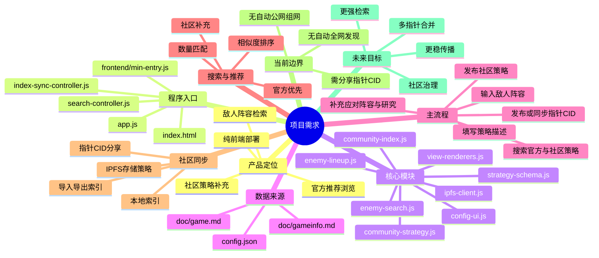

# 项目需求与上下文入口
## 英雄联盟：德玛西亚的崛起 - 策略模拟器

---

## 1. 文档用途
本文件用于后续与大模型协作时提供统一上下文。

使用原则：
- 先看当前实现，再讨论扩展目标
- 文档与代码冲突时，以当前代码和 `config.json` 为准
- 游戏内容优先参考 `config.json` 与 `doc/gameinfo.md`

---

## 2. 当前项目定位
这是一个以**敌人阵容检索**、**官方推荐浏览**、**社区策略补充**为核心的纯前端策略模拟器。

当前主目标：
- 用户先输入敌人阵容
- 系统优先展示官方推荐，并可附带社区相似策略
- 若没有合适方案，用户补充应对阵容、研究与描述
- 用户可将策略发布到社区，并通过 IPNS 公告板维护社区索引入口

交互原则：
- 搜索优先，录入其次
- 描述是主要表达内容，标题弱化
- 官方数据优先，社区数据作为补充

---

## 3. 真实程序入口与核心文件
### 3.1 入口链路
```text
index.html
  -> app.js
    -> frontend/min-entry.js
      -> frontend/search-controller.js
      -> frontend/index-sync-controller.js
```

### 3.2 前端核心文件
- `index.html`：页面结构与主要 DOM 容器
- `app.js`：唯一顶层入口
- `app.css`：页面样式
- `frontend/min-entry.js`：应用启动与全局桥接
- `frontend/search-controller.js`：敌人阵容搜索、投票、输入联动
- `frontend/index-sync-controller.js`：社区索引导入、导出、发布、同步
- `frontend/community-strategy.js`：社区策略创建、缓存、推荐、投票
- `frontend/community-index.js`：本地索引、IPNS pointer candidates 与候选入口机制
- `frontend/ipfs-client.js`：Helia / IPFS / IPNS 读写封装
- `frontend/strategy-schema.js`：社区策略统一数据结构
- `frontend/config-ui.js`：研究、敌人单位、应对单位选择 UI
- `frontend/enemy-lineup.js`：敌人阵容文本解析与编辑
- `frontend/enemy-search.js`：官方 / 社区相似策略匹配
- `frontend/state.js`：前端状态
- `frontend/view-renderers.js`：渲染逻辑
- `frontend/unit-tooltips.js`：单位说明提示
- `frontend/utils.js`：通用工具函数

### 3.3 当前已废弃方向
以下内容不再是当前运行架构的一部分：
- Rust / WASM 运行时入口
- libp2p / Swarm 组网
- Redis 冷启动发现层

---

## 4. 数据与内容来源
### 4.1 结构化真相来源
优先使用 `config.json`，包含：
- 英雄
- 防守单位
- 敌人单位
- 科技树
- 建筑
- 地图节点
- 官方城镇防守推荐
- 社区默认配置

### 4.2 文本参考来源
- `doc/gameinfo.md`：当前版本主要游戏内容参考
- `doc/game.md`：扩展背景与设定参考

### 4.3 默认判定规则
- 当前实现与推荐逻辑：优先 `config.json`
- 游戏说明与推荐依据：其次 `doc/gameinfo.md`
- 扩展设定与长期想法：再参考 `doc/game.md`

---

## 5. 当前主流程
### 5.1 战斗策略主流程
1. 输入敌人阵容文本，或点击补充敌人单位
2. 自动检索官方推荐，并可附带社区相似策略
3. 查看推荐阵容、研究与描述
4. 补充自己的应对阵容、研究与策略描述
5. 发布社区策略到 IPFS
6. 将新策略写入本地社区索引
7. 通过 IPNS 公告板与本地候选入口同步社区索引

### 5.2 当前重点字段
- 敌人阵容
- 应对阵容
- 研究
- 策略描述
- 点赞数 / 点踩数 / 评分

---

## 6. 当前实现能力
### 6.1 已实现
- 官方城镇防守推荐浏览
- 敌人阵容文本快速输入
- 官方相似策略匹配
- 社区策略创建、展示、点赞 / 点踩
- 社区策略本地全文检索
- 本地社区索引持久化
- IPNS pointer candidates 入口发现
- 社区索引导入 / 导出
- 浏览器端 Helia / IPFS 状态展示
- 在线副本声明与聚合显示

### 6.2 当前社区同步方式
当前社区数据共享方式为：
- 浏览器端 Helia / IPFS 存储社区策略 JSON
- 本地索引记录已知策略 CID
- IPNS 公告板维护 `pointer candidates manifest`
- 其他用户优先读取 `current_pointer_cid`，再回退 `fallback_pointer_cids` 与本地候选入口

### 6.3 当前能力边界
当前不具备：
- 自动发布可写 IPNS 根入口
- 浏览器之间自动公网组网
- 完整信誉系统与反刷机制

---

## 7. 搜索与推荐要求
### 7.1 核心搜索对象
- 敌人阵容
- 应对阵容
- 研究
- 策略描述
- 官方推荐关键词

### 7.2 当前搜索规则
- 官方推荐优先展示
- 社区推荐按敌人阵容相似度排序
- 敌人阵容匹配应考虑**单位名称 + 数量**
- 数量接近时允许近似命中
- 无结果时提示用户补充自己的方案

### 7.3 当前排序目标
- 官方结果优先
- 高相似度优先
- 高评分策略优先
- 新近策略可作为次级排序因素

---

## 8. 社区策略要求
### 8.1 当前统一字段
社区策略当前统一为以下语义：
- `target`：敌人阵容文本
- `counter` / `counter_lineup`：应对阵容
- `research` / `counter_tech`：研究
- `description` / `notes`：策略描述
- `likes`
- `dislikes`
- `score`
- `cid`
- `createdAt`

### 8.2 当前产品目标
- 快速补充策略
- 复用已有方案
- 让相同敌人阵容形成策略池
- 高质量方案持续上浮
- 让其他用户可通过索引继续发现策略

---

## 9. 技术架构摘要
### 9.1 当前技术栈
- 前端：原生 HTML / CSS / JS
- 内容存储：Helia + UnixFS
- 本地持久化：`localStorage`
- 入口发现：IPNS 公告板 + 本地候选入口
- 部署方式：GitHub Pages / 任意静态站点

### 9.2 当前架构关键词
- 纯前端
- 无自建后端
- Helia / IPFS
- IPNS pointer candidates manifest
- 社区索引同步
- 官方 + 社区混合搜索

### 9.3 未来目标
- 多 IPNS 来源合并
- 更强的社区排序与检索
- 更稳定的内容传播方式
- 更完整的社区治理与质量控制

---

## 10. 主要文件可信度
### 第一层：实现真相
- `index.html`
- `app.js`
- `frontend/min-entry.js`
- `frontend/search-controller.js`
- `frontend/index-sync-controller.js`
- `frontend/community-strategy.js`
- `frontend/community-index.js`
- `frontend/ipfs-client.js`
- `frontend/strategy-schema.js`
- `config.json`

### 第二层：需求与内容参考
- `need.md`
- `doc/gameinfo.md`

### 第三层：补充说明
- `doc/game.md`
- `readme.md`

---

## 11. 需求脑图


---

## 12. 后续协作默认规则
- 默认先读：`need.md`、`index.html`、`app.js`、`frontend/min-entry.js`、`config.json`
- 涉及社区功能时，继续读：`frontend/community-strategy.js`、`frontend/community-index.js`、`frontend/ipfs-client.js`
- 涉及搜索功能时，继续读：`frontend/enemy-lineup.js`、`frontend/enemy-search.js`、`frontend/strategy-schema.js`
- 涉及游戏文本和官方推荐时，优先读：`config.json`、`doc/gameinfo.md`

---

## 13. 摘要
这是一个以**敌人阵容搜索**、**官方推荐**、**社区策略沉淀**为核心的纯前端策略模拟器。

当前真实入口：
`index.html -> app.js -> frontend/min-entry.js`

当前社区方案：
`Helia / IPFS + 本地社区索引 + 指针 CID 同步`

当前结构化内容优先看：`config.json`
当前游戏推荐依据优先看：`doc/gameinfo.md`
