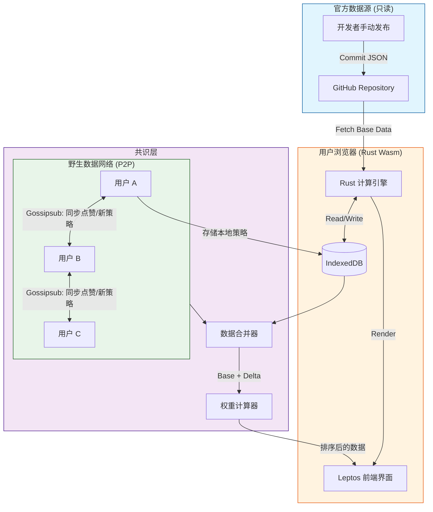

# 英雄联盟：德玛西亚的崛起 - 策略模拟器
### (League of Legends: Rise of Demacia - Strategy Simulator)

> **版本**: 0.1.0 (Alpha)  
> **状态**: 社区驱动开发 (Community Driven)  
> **核心理念**: 官方定基准，社区定策略。数据永不丢失，智慧共同进化。

---

## 🛡️ 项目简介

**“德玛西亚的崛起”** 是一个基于 Web 的开源策略模拟引擎，专为《英雄联盟》德玛西亚阵营的粉丝、战术分析师和游戏玩家设计。本项目不依赖中心化的游戏服务器，而是采用独特的 **“Git + P2P” 混合架构**：

1.  **官方基准数据 (Official Baseline)**：由核心开发者维护，通过 GitHub 发布最准确的英雄属性、技能机制、建筑科技树和基础资源模型。保证模拟器的**准确性**和**一致性**。
2.  **野生策略数据 (Wild Strategies)**：由全球用户分布式贡献。包括针对特定阵容的**最小应对方案**、**极限运营路线**、**黑科技打法**等。
3.  **共识机制 (Consensus via Likes)**：用户通过“点赞”为策略投票。高赞策略会自动在所有人的模拟器中**权重提升**、**置顶显示**，甚至被标记为“德玛西亚推奨战术”。低质或过时策略会自动沉底。

**无需注册，无需服务器，打开网页即可体验德玛西亚的荣光！**

---

## ⚔️ 核心功能模块

### 1. 资源模拟系统 (Resource Simulation)
模拟德玛西亚王国的经济与发展体系。
- **资源类型**: 金币 (Gold), 人口 (Population), 光盾素材 (Petricite), 军备值 (Munitions).
- **建筑科技树**: 
  - 基础：农场、兵营、采石场。
  - 进阶：光盾实验室、骑士训练场、禁魔雕像。
  - **野生扩展**: 用户可以提交新的建筑组合方案（例如：“速冲流：跳过农场，直接暴兵”），经社区点赞后成为可选科技路线。
- **动态事件**: 模拟诺克萨斯入侵、法师叛乱等随机事件对资源的影响。

### 2. 战斗模拟系统 (Combat Simulation)
基于回合制或即时演算的战斗引擎。
- **阵容构建**: 选择盖伦、拉克丝、嘉文四世等英雄，搭配士兵类型。
- **战术指令**: 设置集火目标、撤退阈值、技能释放时机。
- **对抗推演**: 
  - **PVE**: 对抗预设的诺克萨斯或暗影岛 AI。
  - **PVP (异步)**: 上传自己的阵容配置，与其他玩家的配置进行离线模拟对战。
- **野生对策库**: 
  - *场景*: “如何用最少的兵力击败‘蔚 + 塞拉斯’的切入阵容？”
  - *方案*: 用户提交具体站位和出装，社区点赞验证有效性。高赞方案将作为“标准答案”推荐给所有遇到该困境的玩家。

---

## 🏗️ 技术架构

本项目采用 **Rust + WebAssembly (Wasm)** 构建核心逻辑，确保高性能与跨平台一致性；前端使用 **Leptos** 实现响应式 UI；数据存储采用 **GitHub (官方) + IndexedDB/P2P (用户)** 混合模式。

### 架构图



### 数据流说明

1.  **初始化**: 页面加载时，Wasm 从 GitHub 拉取最新的 `official_data.json` (包含英雄基础数值、建筑成本等)。
2.  **本地合并**: 从 IndexedDB 读取用户本地的“野生策略”和“点赞记录”。
3.  **P2P 同步**: 加入 libp2p 网络，订阅 `demacia-strategies` 主题。接收其他节点广播的新策略或点赞更新。
4.  **权重计算**: 
    $$ Score = (IsOfficial ? 1000 : 0) + (Likes \times 1.0) - (Dislikes \times 2.0) + TimeDecay $$
5.  **渲染**: UI 根据分数高低展示策略。官方数据永远可见，野生数据需达到一定分数才会高亮显示。

---

## 📂 项目结构

```text
demacia-rise/
├── Cargo.toml              # Rust 项目配置
├── Trunk.toml              # Wasm 构建配置
├── README.md               # 本文件
├── data/                   # 官方数据源 (手动维护后推送到 GitHub)
│   ├── official_heroes.json
│   ├── official_buildings.json
│   └── base_scenarios.json
├── src/
│   ├── main.rs             # 入口
│   ├── app.rs              # UI 组件 (Leptos)
│   ├── engine/
│   │   ├── resource.rs     # 资源模拟逻辑
│   │   ├── combat.rs       # 战斗模拟逻辑
│   │   └── resolver.rs     # 策略求解器
│   ├── data_model.rs       # 数据结构 (Official vs Wild)
│   ├── storage.rs          # IndexedDB 操作
│   ├── p2p.rs              # libp2p 节点逻辑
│   └── consensus.rs        # 点赞权重算法
├── tests/                  # 单元测试
│   ├── combat_test.rs
│   └── economy_test.rs
└── docs/                   # 文档
    └── contribution.md     # 如何提交野生数据
```

---

## 🚀 快速开始

### 前置要求
- Rust 工具链 (`rustup`)
- `trunk` (用于构建 Wasm Web 应用)
- 现代浏览器 (Chrome/Firefox/Edge)

### 本地运行

1.  **克隆项目**:
    ```bash
    git clone https://github.com/your-org/demacia-rise.git
    cd demacia-rise
    ```

2.  **安装 Wasm 目标**:
    ```bash
    rustup target add wasm32-unknown-unknown
    cargo install trunk
    ```

3.  **启动开发服务器**:
    ```bash
    trunk serve --open
    ```
    浏览器将自动打开，你将看到默认的官方数据。尝试点击“创建新策略”并点赞，刷新页面后数据依然存在（存储在 IndexedDB）。

4.  **体验 P2P 同步**:
    - 打开两个不同的浏览器窗口（或无痕模式）。
    - 在一个窗口创建策略并点赞。
    - 观察另一个窗口是否自动接收到更新（需在同一局域网或连接公共引导节点）。

---

## 🤝 如何贡献 (野生数据)

我们不需要你提交代码来分享你的战术！

### 方式一：直接在应用中贡献 (推荐)
1.  打开网页版模拟器。
2.  进入“战术实验室”，配置你的阵容或建筑路线。
3.  点击“发布到社区”。
4.  你的策略会生成一个唯一的 ID，并通过 P2P 网络广播给其他在线用户。
5.  **获得点赞**: 当足够多的用户验证并点赞你的策略时，它将成为“德玛西亚公认战术”，在所有用户的客户端中高亮显示。

### 方式二：提交官方数据修正 (PR)
如果你发现官方基础数据（如盖伦的基础攻击力）有误：
1.  Fork 本仓库。
2.  修改 `data/official_heroes.json`。
3.  提交 Pull Request。
4.  维护者合并后，所有用户下次刷新将自动获得修正后的基准数据。

---

## 📜 数据规范

### 官方数据示例 (`official_heroes.json`)
```json
[
  {
    "id": "garen",
    "name": "盖伦",
    "hp": 620,
    "attack": 66,
    "role": "Tank/Fighter",
    "abilities": ["decisive_strike", "courage", "judgment", "demacian_justice"]
  }
]
```

### 野生策略示例 (内部结构)
```json
{
  "id": "uuid-v4-string",
  "type": "counter_strategy",
  "target_official_id": "sylas_composition",
  "title": "针对塞拉斯的最低成本反制阵容",
  "description": "使用拉克丝远程消耗，盖伦带净化，无需出魔抗装...",
  "requirements": {
    "buildings": ["light_shield_lab"],
    "tech_level": 2
  },
  "creator_peer": "QmPeerID...",
  "likes": 145,
  "dislikes": 3,
  "timestamp": 1710500000
}
```

---

## 🔮 路线图 (Roadmap)

- [ ] **Phase 1 (当前)**: 核心资源与战斗模拟引擎，GitHub 数据同步，本地存储。
- [ ] **Phase 2**: 集成 libp2p，实现浏览器间的策略与点赞同步。
- [ ] **Phase 3**: 引入信誉系统，防止刷赞；增加更多德玛西亚英雄与剧情事件。
- [ ] **Phase 4**: 支持移动端 PWA，离线可用；导出/导入策略分享码。
- [ ] **Phase 5**: 社区锦标赛模式，自动匹配最佳野生策略进行 AI 对战。

---

## ⚖️ 许可证

- **代码**: MIT License
- **官方数据**: CC BY-NC-SA 4.0 (非商业性使用，共享相同方式)
- **野生数据**: 归创作者所有，但在本网络中传播即视为同意 CC BY-SA 协议。

---

## 📢 免责声明

本项目是粉丝制作的非官方工具，与 Riot Games 无关。《英雄联盟》及其所有相关属性均为 Riot Games, Inc 的商标。我们热爱德玛西亚，也尊重符文之地的所有规则。

**为了德玛西亚！(For Demacia!)** 🛡️🦁